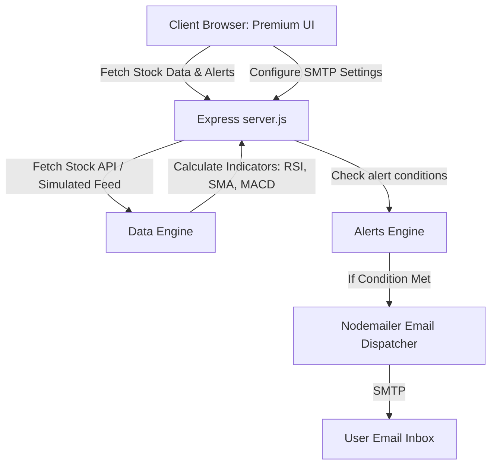

# Implementation Plan: GBM Invest-Alerts Analyzer

A premium, interactive web platform for investment, stock, and trend analysis that tracks technical indicators, simulates portfolios, and sends gorgeous email alerts when user-defined price/trend thresholds are crossed.

---

## User Review Required

> [!IMPORTANT]
> **Email Alert Dispatching (SMTP Configuration)**
> To send actual emails, the Node.js backend requires SMTP server credentials (e.g., Gmail App Password, Outlook, Mailgun, or Resend).
> - We will provide an elegant UI settings panel and a `.env` configuration file to easily enter these.
> - For security, these credentials will remain 100% local on your machine.
> - We will also provide a **local console logger/mock email sender** so you can test alert triggers immediately without any configuration.

> [!TIP]
> **Data Feeds & Fallbacks**
> - Out-of-the-box, the app will include a **high-fidelity market generator** that simulates real-time price fluctuations, trades, and indicator updates for visual excellence.
> - We will also support fetching real-world data from free Yahoo Finance/CoinGecko scrapers or APIs, giving you the best of both worlds.

---

## Proposed Architectural Structure

We will build this as a cohesive, lightweight, and robust Node.js application. Serving the frontend files directly from the Express server avoids cross-origin complex setups and makes running it incredibly simple:

### Components and Files to Create

#### 1. [NEW] [package.json](file:///h:/PROYECTO%20GBM/package.json)
Contains project metadata, scripts, and dependencies:
- `express`: Fast, unopinionated web framework for API endpoints.
- `nodemailer`: Library for sending emails easily from Node.js.
- `dotenv`: Manage environment variables locally.
- `cors`: Handle cross-origin requests safely.

#### 2. [NEW] [server.js](file:///h:/PROYECTO%20GBM/server.js)
The brain of the system:
- **Web API Server**: Serves frontend static files and exposes JSON REST endpoints (`/api/stocks`, `/api/alerts`, `/api/settings`, `/api/portfolio`).
- **Data Engine**: Generates real-time price feeds and calculates technical indicators:
  - **SMA (Simple Moving Average)**: Identifies support/resistance.
  - **EMA (Exponential Moving Average)**: Tracks trend momentum.
  - **RSI (Relative Strength Index)**: Identifies overbought (>70) and oversold (<30) conditions.
  - **MACD**: Measures trend strength.
- **Alerts Monitor**: A background interval loop (running every 5 seconds) that checks if active alerts are triggered.
- **Email Service**: Formats and dispatches stylized HTML emails with modern CSS styling (e.g. green success for bullish breakouts, red warnings for crashes).

#### 3. [NEW] [public/index.html](file:///h:/PROYECTO%20GBM/public/index.html)
The structure of our beautiful interface. Key sections:
- **Glowing Ticker Tape**: Marquee-style live ticker at the top.
- **Market Dashboard Grid**:
  - Live charts with timeframes (1D, 1W, 1M).
  - Selected asset details (Price, change, market cap, high/low, sentiment).
- **Technical Analysis Gauge**: Visual speedometers showing Buy/Sell/Neutral status.
- **Alerts Panel**: A form to create custom alerts (Asset, Metric [Price, RSI, SMA], Condition [Greater than, Less than], Threshold) and a list of active alerts.
- **Simulator & Portfolio Tracker**: Track virtual cash, buys/sells, and current profit/loss.
- **Settings Card**: Configure email preferences, SMTP, and test connections.

#### 4. [NEW] [public/style.css](file:///h:/PROYECTO%20GBM/public/style.css)
An ultra-premium, dark-themed styling sheet using HSL tailored colors:
- Background: `#0b0f19` (Obsidian Deep Slate).
- Cards: `rgba(17, 24, 39, 0.7)` with `backdrop-filter: blur(12px)` and subtle glowing borders.
- Alerts/Gradients: Elegant purple, teal, emerald, and ruby accents.
- Responsive, modern grid systems with flexible layouts.
- Micro-animations for button hovers, status dots, and live price flashes (green for up, red for down).

#### 5. [NEW] [public/app.js](file:///h:/PROYECTO%20GBM/public/app.js)
The frontend controller:
- Connects to backend API endpoints.
- Renders highly responsive and beautiful multi-line charts using **Chart.js** (including customized grid lines, gradient fills, and tooltips).
- Handles user interactions (submitting alerts, buying/selling simulated assets, shifting timeframes, modifying SMTP setup).
- Performs client-side updates such as color-flashing elements when prices shift.

#### 6. [NEW] [.env.example](file:///h:/PROYECTO%20GBM/.env.example) and [.env](file:///h:/PROYECTO%20GBM/.env)
Standard template for storing the port, mock mode, and SMTP credentials.

---

## Verification Plan

### Automated & Manual Verification
1. **Interactive UI Walkthrough**: We will launch the application and open the dashboard in a browser.
2. **Real-time Price Engine Verification**: Check if prices are updating smoothly, tickers are moving, and indicators are calculating correctly.
3. **Alert Triggering Test**: Create an alert close to the current price (e.g., alert if price is greater than `$current_price + 1`) and watch the alert trigger.
4. **Email Dispatching Test**:
   - Check Express logs to verify that when an alert triggers, the email template is generated and logged.
   - Run a test SMTP dispatch with real credentials to confirm the beautiful HTML email arrives in the inbox.
5. **Investment Simulation**: Buy and sell assets to ensure portfolio values and yields update dynamically.
